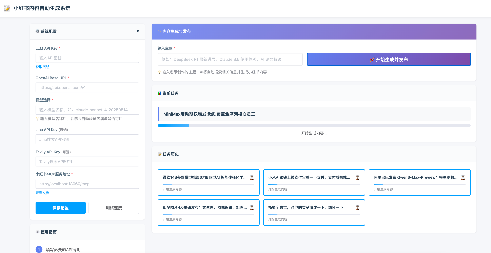
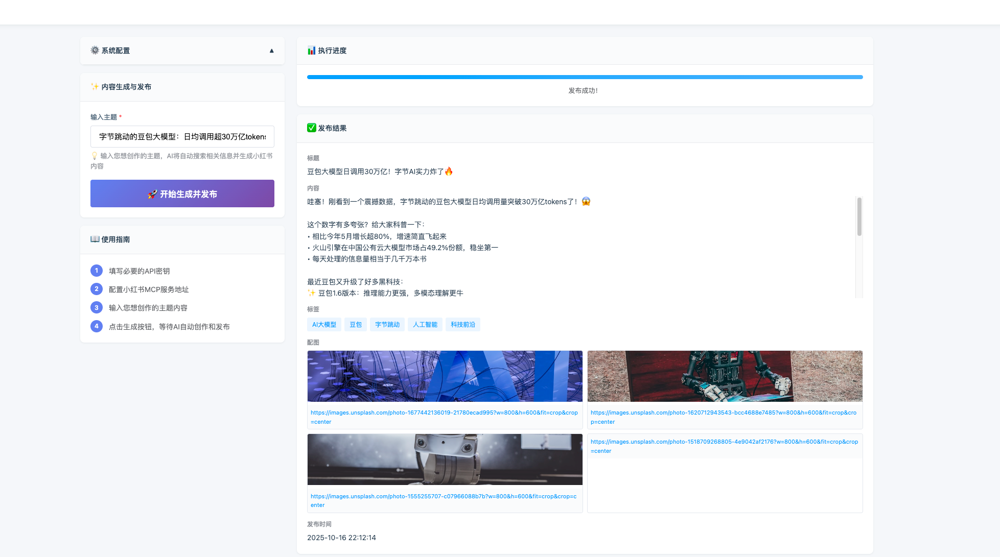
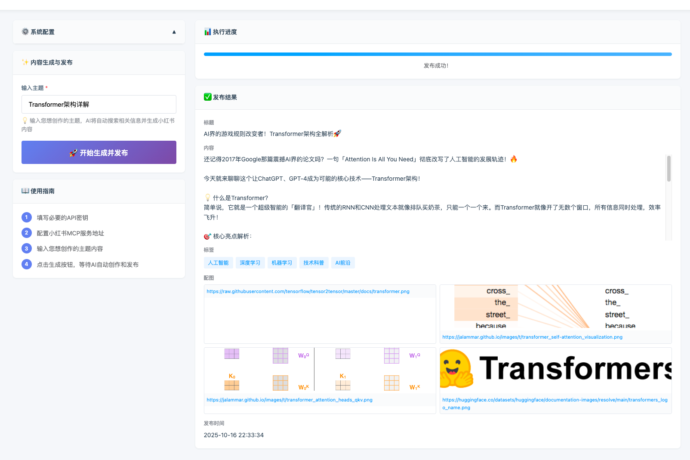

# Xiaohongshu AI Content Generation & Publishing System

[中文](README.md) | English

An AI-powered intelligent Xiaohongshu (Little Red Book) content generation and automatic publishing web application. It integrates multiple tool services through MCP (Model Context Protocol) to achieve a fully automated workflow from topic input to content publishing.

**In simple terms: Input a topic, and AI handles everything for you, publishing directly to your Xiaohongshu account**




## ✨ Features

- 🎨 **Modern Web Interface** - Clean and beautiful left-right panel layout with responsive design
- ⚙️ **Configuration Management** - All configurations input through web interface, automatically saved to config files
- 🔌 **MCP Service Integration** - Integrates three major MCP services: Jina Search, Tavily Search, and Xiaohongshu Publishing
- 🤖 **Intelligent Content Generation** - Automatically retrieves information, analyzes, and writes articles based on user topics
- 📝 **Auto Formatting** - Automatically adapts to Xiaohongshu publishing format (title, content, tags, images)
- 🚀 **One-Click Publishing** - Automatically publishes to Xiaohongshu platform after generation
- 📊 **Real-time Progress** - Displays execution progress and status information
- ✅ **Result Display** - Shows final published title, content, tags, images, etc.

**A Quick Ad**

This is my personal account, all articles are written by this project


[Personal Homepage](https://www.xiaohongshu.com/user/profile/60857eed0000000001008826) - Welcome to visit, follow me for first-hand AI resources


## 📋 Prerequisites

### 1. Start Xiaohongshu MCP Service

**You must first start the [xiaohongshu-mcp](https://github.com/xpzouying/xiaohongshu-mcp) service**


```bash
# 1. Clone the Xiaohongshu MCP project
git clone https://github.com/xpzouying/xiaohongshu-mcp.git
cd xiaohongshu-mcp

# 2. Start the service following the project README instructions
# Default service address: http://localhost:18060/mcp
```
⚠️Note: You need to log in to your Xiaohongshu account first (follow the login method in the MCP service)

### 2. System Environment

- Python 3.8+
- Node.js 16+ (for MCP tools)
- npm/npx (for running MCP tools)

## 🚀 Quick Start

### 1. Install Dependencies

```bash
cd xhs_web_app
pip install -r requirements.txt
```

### 2. Start Application

```bash
python app.py
```

The application starts by default at `http://localhost:8080`.

### 3. Configure System

Visit `http://localhost:8080` and configure the following information in the left panel:

#### Required Configuration

| Configuration | Description | Example |
|---------------|-------------|---------|
| **LLM API Key** | OpenAI-compatible API key | `sk-xxx...` |
| **OpenAI Base URL** | API base address | `https://api.openai.com/v1` or `https://usw.sealos.io/v1` |
| **Default Model** | LLM model to use | `claude-sonnet-4-20250514` (recommended) |
| **Xiaohongshu MCP Service URL** | MCP service URL | `http://localhost:18060/mcp` |

#### Optional Configuration

| Configuration | Description | How to Get |
|---------------|-------------|------------|
| **Jina API Key** | Jina search service key | [Jina Official Site](https://jina.ai/) |
| **Tavily API Key** | Tavily search service key | [Tavily Official Site](https://tavily.com/) |

Recommend using Tavily as the search tool, which offers 1000 free search requests per month

> 💡 **Tip**: Click the "Get Key" or "View Documentation" links next to configuration items to jump directly to the corresponding service websites.


### 4. Generate Content

1. Input a topic in the "Content Generation & Publishing" area
2. Click the "🚀 Start Generation & Publishing" button
3. View execution progress and final results on the right side

#### Topic Examples

- "ByteDance's Doubao Model: Daily API calls exceed 30 trillion tokens, with impressive growth!"

- "Claude 3.5 Sonnet User Experience"
- "AI Development Trends Prediction for 2025"
- "Transformer Architecture Explained"



## 📂 Project Structure

```
xhs_web_app/
├── app.py                      # FastAPI main program
├── requirements.txt            # Python dependencies
├── README.md                   # This document
│
├── config/                     # Configuration module
│   ├── __init__.py
│   ├── config_manager.py       # Configuration manager
│   ├── app_config.json         # App config (auto-generated)
│   ├── servers_config.json     # MCP server config (auto-generated)
│   └── .env                    # Environment variables (auto-generated)
│
├── core/                       # Core functionality module
│   ├── __init__.py
│   └── content_generator.py    # Content generator (based on MCP tool execution)
│
├── static/                     # Static resources
│   ├── css/
│   │   └── style.css          # Style file
│   └── js/
│       └── app.js             # Frontend interaction logic
│
└── templates/                  # HTML templates
    └── index.html             # Main page
```

## 🔧 Configuration File Description

### 1. app_config.json

Stores main application configuration:

```json
{
  "llm_api_key": "sk-xxx...",
  "openai_base_url": "https://api.openai.com/v1",
  "default_model": "claude-sonnet-4-20250514",
  "jina_api_key": "jina_xxx...",
  "tavily_api_key": "tvly_xxx...",
  "xhs_mcp_url": "http://localhost:18060/mcp"
}
```

### 2. servers_config.json

MCP server configuration (auto-generated based on app_config.json):

```json
{
  "mcpServers": {
    "jina-mcp-tools": {
      "command": "npx",
      "args": ["jina-mcp-tools"],
      "env": {
        "JINA_API_KEY": "jina_xxx..."
      }
    },
    "tavily-remote": {
      "command": "npx",
      "args": ["-y", "mcp-remote", "https://mcp.tavily.com/mcp/?tavilyApiKey=tvly_xxx..."]
    },
    "xhs": {
      "type": "streamable_http",
      "url": "http://localhost:18060/mcp"
    }
  }
}
```

## 🎯 Content Generation Process

The system uses a 4-step workflow to automatically generate and publish content:

### Step 1: Information Retrieval
- Uses Jina or Tavily search tools
- Retrieves latest information from the past 7-30 days
- Collects 5-8 high-quality resources
- Obtains 3-4 related images

### Step 2: Article Writing
- Writes professional articles based on collected materials
- Title limited to 20 characters
- Content 800-1200 words
- Uses youthful and lively language style
- Appropriately adds emojis for engagement

### Step 3: Format Adaptation
- Adjusts to Xiaohongshu-specific format
- Removes # tags, converts to natural language
- Extracts 5 precise topic tags
- Validates image link availability
- Generates standard JSON format

### Step 4: Auto Publishing
- Calls Xiaohongshu MCP service
- Publishes content to Xiaohongshu platform
- Returns publishing results
- **Automatically stops iteration upon successful publishing**

## 🌐 API Endpoints

| Method | Path | Description |
|--------|------|-------------|
| GET | `/` | Main page |
| GET | `/api/config` | Get configuration (hides sensitive info) |
| POST | `/api/config` | Save configuration |
| POST | `/api/test-login` | Test Xiaohongshu MCP connection |
| POST | `/api/generate-and-publish` | Generate and publish content |

## 🛠️ Tech Stack

### Backend
- **FastAPI** - Modern web framework
- **MCP (Model Context Protocol)** - Tool service integration
- **OpenAI SDK** - LLM API calls
- **aiohttp** - Async HTTP client

### Frontend
- **Native HTML/CSS/JavaScript** - Lightweight, no build required
- **Element UI Style** - Clean and beautiful UI design
- **Responsive Layout** - Supports desktop and mobile

### MCP Tool Services
- **Jina MCP Tools** - Web search and content scraping
- **Tavily Remote** - Deep web search
- **XHS MCP** - Xiaohongshu content publishing

## ⚠️ Important Notes

### 1. Security
- ✅ API keys configured through web interface, automatically saved to local files
- ✅ Config files automatically added to `.gitignore` to prevent leaks
- ⚠️ Do not commit configuration files with real keys to version control

### 2. MCP Service Dependencies
- ❗ **Must start Xiaohongshu MCP service first**, otherwise cannot publish content
- Default MCP service address: `http://localhost:18060/mcp`
- Can verify service status through "Test Connection" button

### 3. Network and API
- Requires stable network connection to access LLM API
- Search tools require corresponding API keys (optional)
- Generation process may take 1-3 minutes, please be patient

### 4. Content Compliance
- Generated content should be manually reviewed before publishing
- Ensure content complies with Xiaohongshu platform regulations
- Avoid sensitive topics or prohibited content

## 🐛 Troubleshooting

### Issue 1: Cannot connect to Xiaohongshu MCP service

**Symptoms**: "Test Connection" fails, connection error

**Solutions**:
1. Confirm [xiaohongshu-mcp](https://github.com/xpzouying/xiaohongshu-mcp) service is started
2. Check if MCP service address is correct (default `http://localhost:18060/mcp`)
3. Check if firewall is blocking port 18060
4. View MCP service logs to confirm its running status

### Issue 2: Content generation fails

**Symptoms**: Generation process errors or returns failure

**Solutions**:
1. Check if LLM API Key is valid and has sufficient quota
2. Verify OpenAI Base URL is correct
3. Confirm network connection is normal
4. Check backend logs for specific error information

### Issue 3: System keeps iterating after publishing

**Symptoms**: System continues calling tools after successful publishing

**Solutions**:
- New version fixed: Automatically stops iteration upon detecting successful `publish_content`
- Ensure using latest code

### Issue 4: Images not displaying

**Symptoms**: Generated content image links are invalid

**Solutions**:
1. Check if image URLs are accessible (must be HTTPS)
2. Some images may have hotlink protection
3. Try different search keywords to get other images

## 🔄 Development Guide

### Modify System Prompts

Prompts are located in the `execute_step` method of `core/content_generator.py`:

```python
system_prompt = f"""You are a professional Xiaohongshu content creation AI assistant...
```

### Adjust Research Plan

Research steps are defined in the `get_research_plan` method:

```python
def get_research_plan(self, user_topic: str) -> List[Dict[str, Any]]:
    return [
        {
            "id": "step1",
            "title": f"Information retrieval for「{user_topic}」topic",
            ...
        },
        ...
    ]
```

### Add New MCP Services

Add new service configuration in the `initialize_servers` method:

```python
server_config = {
    "mcpServers": {
        "your-service": {
            "command": "...",
            "args": [...],
            ...
        }
    }
}
```

## 📝 License

This project is for learning and research purposes only. When using this project, please comply with:
- OpenAI API Terms of Service
- Xiaohongshu platform rules
- Terms of service for each MCP service provider

## 🔗 Related Links

- [Xiaohongshu MCP Service](https://github.com/xpzouying/xiaohongshu-mcp) - Required dependency service
- [Sealos API Platform](https://usw.sealos.io/) - Get LLM API key
- [Jina AI](https://jina.ai/) - Get Jina API key
- [Tavily](https://tavily.com/) - Get Tavily API key

## 📧 Support & Feedback

For questions or suggestions, welcome to:
- Submit Issues
- Create Pull Requests
- Contact project maintainers


## ⚠️ Final Notes
This project can serve as a learning case for agents, but is not recommended for direct production use.

The overall project logic is abstracting a more general agent architecture:
- Configurable MCP
- Select different tools to complete complex tasks
- Agent context retrieval and compression
- Agent multi-turn dialogue and memory
- .....

---
**Welcome to star! Happy Creating! 🎉**